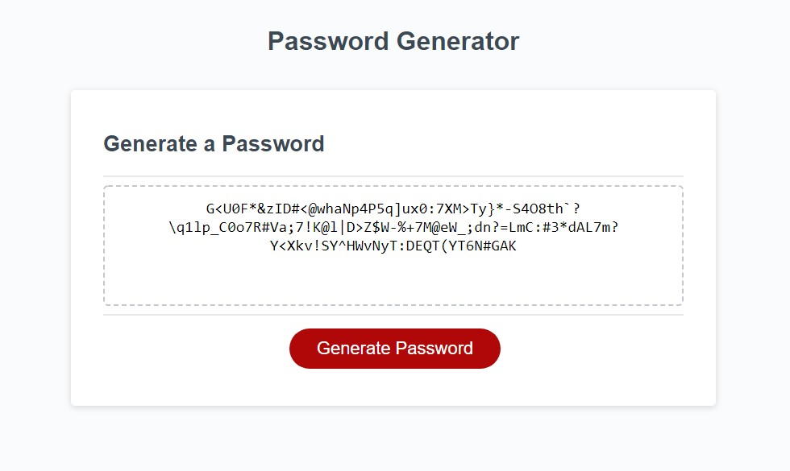

# Password Generator

## Description

A simple JavaScript password generator. Solves the issue of not having a secure password by randomly generating one with criteria selection (Uppercase letters, lowercase letters, special characters, numbers). My motivation for this project was to use my current JavaScript knowledge, and to expand my JavaScript knowledge.

## Installation

No installation required, open the website in your browser. Website: [Password Generator](https://norklas.github.io/siberian-fluff/).

## Usage

To use, simply click the generate button. Upon clicking the button, you'll be presented with a prompt to provide password length. After supplying the password length, a confirm prompt will appear to ask if you want to include numbers, followed by one to include lowercase letters, followed by another for uppercase letters, then one more for special characters. Upon supplying all the prompts with your answers, a password will generate according to what you chose in the previous prompts.

## Collaborators

Starter Code: [Starter Code](https://github.com/coding-boot-camp/friendly-parakeet)

Xandromus for starter code: [Xandromus' Github](https://github.com/Xandromus)
